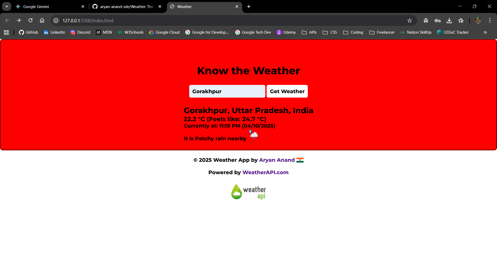
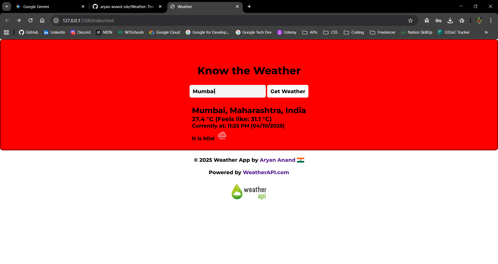
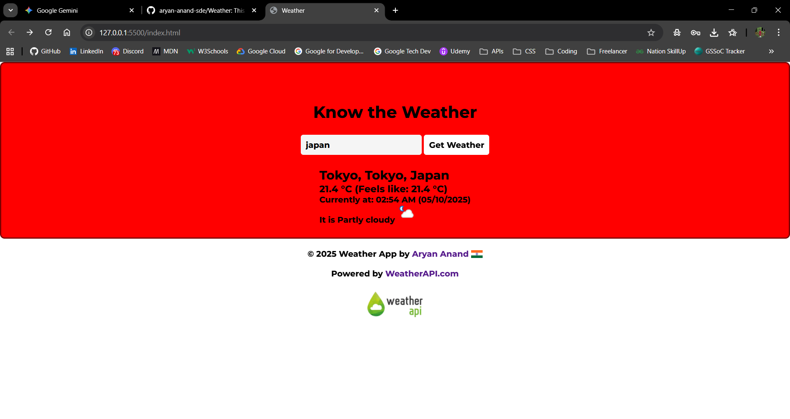
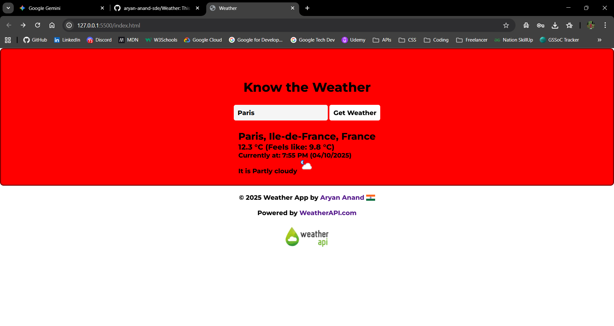

# 🌦️ Weather App

A modern, responsive, and minimalist weather dashboard that provides real-time atmospheric data for any location across the globe. Built with a focus on simplicity and accuracy using the **WeatherAPI**.


## ✨ Features

- **Global Search**: Instantly find weather data for any city, state, or country.
- **Real-time Data**: Get current temperature, "feels like" temperature, and weather conditions.
- **Dynamic Icons**: Visual representation of current weather conditions (sunny, cloudy, rainy, etc.).
- **Local Time**: Displays the local date and time of the searched location.
- **Responsive Design**: Clean UI that works across various screen sizes.

## 🚀 Live Demo

Check out the different views of the application:

|              Gorakhpur               |             Mumbai             |            Japan             |            Paris             |
| :----------------------------------: | :----------------------------: | :--------------------------: | :--------------------------: |
|  |  |  |  |

## 🛠️ Tech Stack

- **Frontend**: HTML5, CSS3, JavaScript (ES6+)
- **API**: [WeatherAPI](https://www.weatherapi.com/)
- **Typography**: [Montserrat](https://fonts.google.com/specimen/Montserrat) & [Luckiest Guy](https://fonts.google.com/specimen/Luckiest+Guy)

## 📦 Getting Started

1. **Clone the repository**:

   ```bash
   git clone https://github.com/aryan-anand-sde/Weather.git
   ```

2. **Navigate to the project directory**:

````bash
    cd Weather
    ```

3. **API Key Setup**:
    The project currently uses a pre-configured API key. If you wish to use your own:
    - Sign up at [WeatherAPI](https://www.weatherapi.com/).
    - Replace the `key` parameter in the `url` variable inside `script.js`.

4.  **Launch the App**:
    Simply open `index.html` in your favorite web browser.

## 📝 Usage

- Enter the name of a city (e.g., "London", "New York", "Tokyo") in the search bar.
- Click **"Get Weather"** or press **Enter**.
- The dashboard will update with the latest weather information for that location.

## 🤝 Contributing

Contributions, issues, and feature requests are welcome! Feel free to check the [issues page](https://github.com/aryan-anand-sde/Weather/issues).

## 👤 Author

**Aryan Anand**

- GitHub: [@aryan-anand-sde](https://github.com/aryan-anand-sde)
- Location: 🇮🇳 India

---

_Created with ❤️ by Aryan Anand_
````
